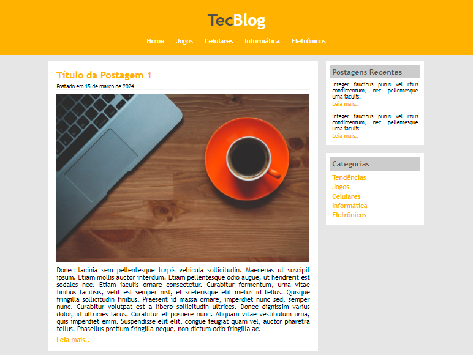
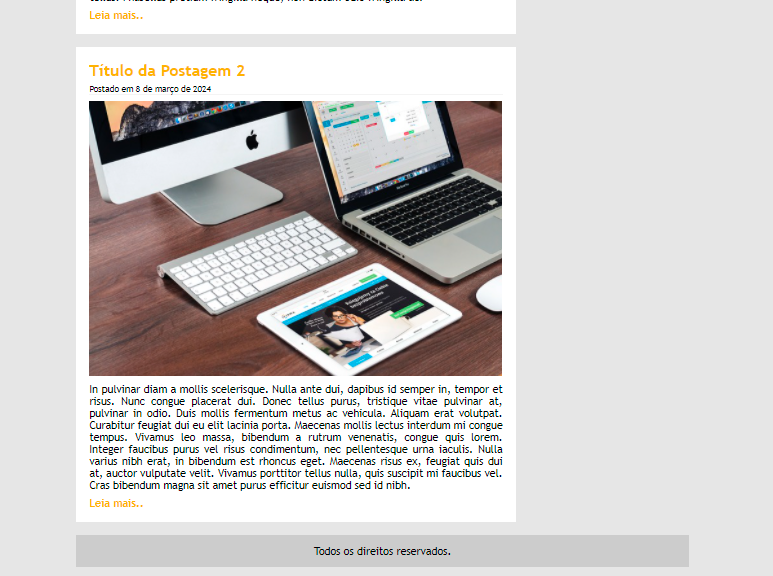
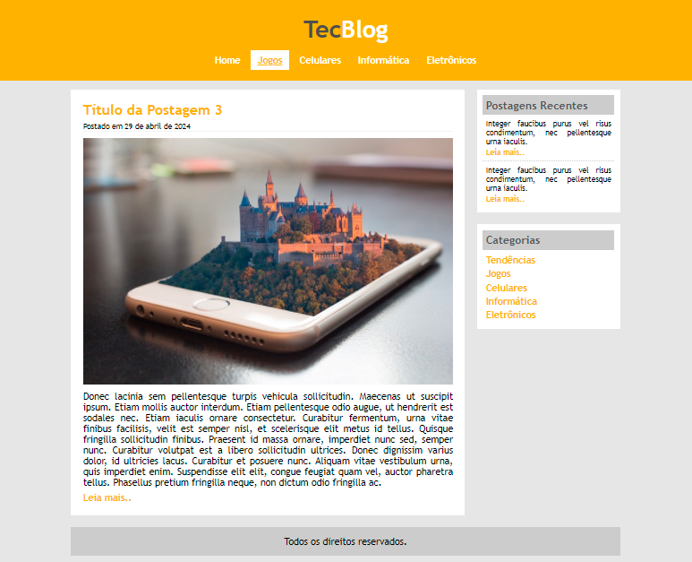

# Projeto3_TecBlog
>Blog fictício sobre tecnologia com menu, área de conteúdo e área lateral.

Este projeto finaliza a seção 4 que introduz os conhecimentos básicos sobre CSS, e com isso foi possível montar uma estrutura contendo um cabeçalho, com menu e logo do site, uma área de postagem e uma área lateral, que foi divida onde uma parte contém as últimas postagens e outra as categorias das matérias do site.

## Objetivo

Exercitar os conhecimentos adquiridos até o momento no curso, utilizar `id` e `class` para aplicar formatações. Com o uso do `float` alterar o fluxo dos elementos e assim criar um layout mais interessante.

## Dados
**LinkedIn** [Daniella Gama](https://www.linkedin.com/in/danigvg/) - **E-mail**: danigvg@outlook.com

[Projeto TecBlog](https://github.com/danigvg/Projeto3_TecBlog)