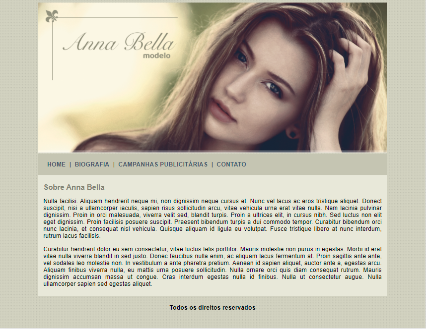
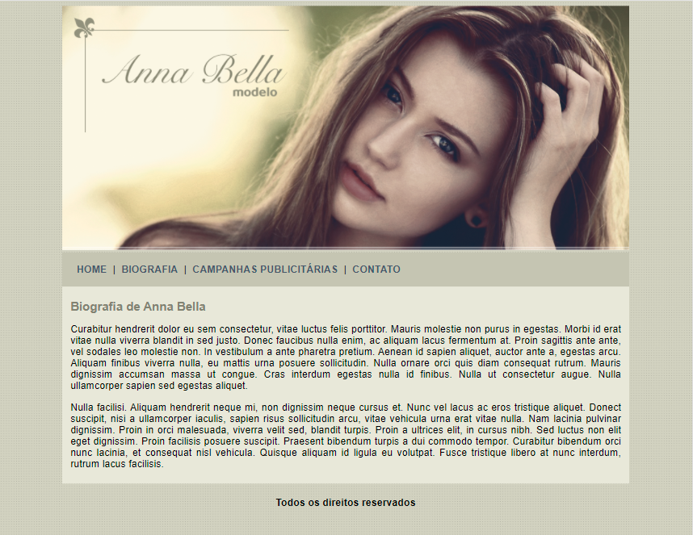
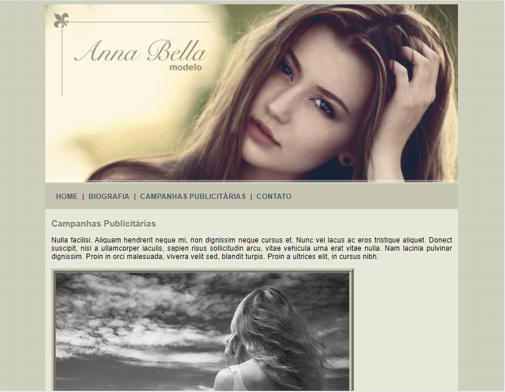
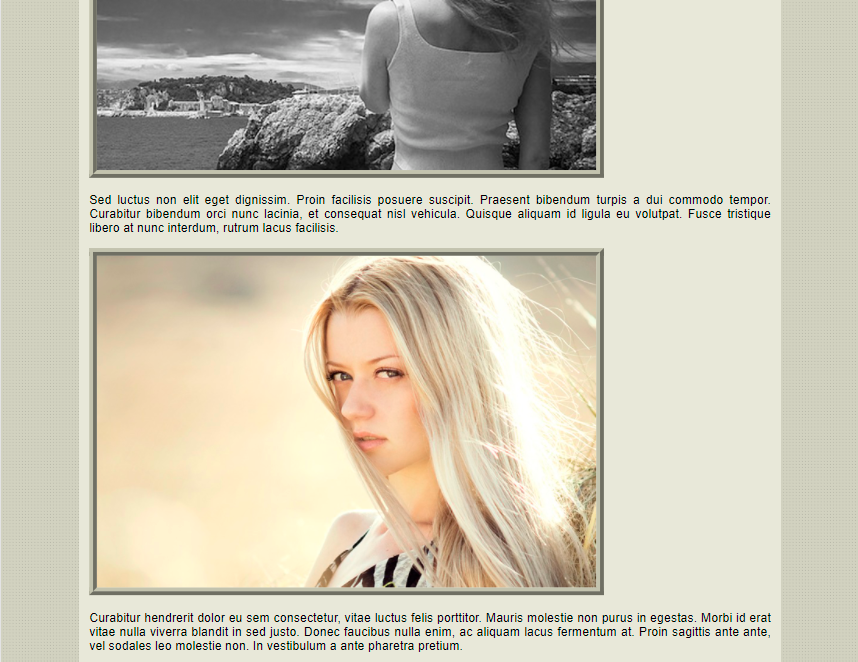
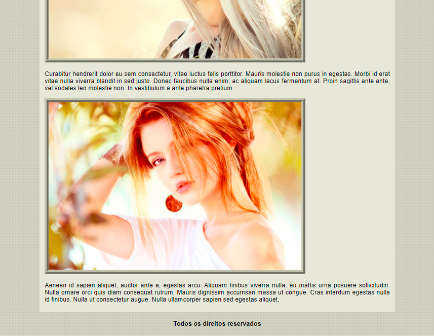
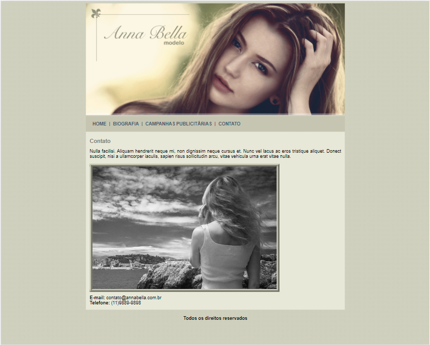

# Projeto2_AnaBella
>Site da modelo fictícia Anna Bella.

Projeto contendo página principal, biografia, campanhas publicitárias e contato da modelo, feito em html e css.Este é o 2º projeto do curso de Desenvolvimento Web que faço pela plataforma [Udemy](https://www.udemy.com/course/web-completo/), e o 1º da seção 04 que introduz a estilização de páginas HTML com CSS.

## Objetivo

A finalidade deste projeto é iniciar, ao mesmo tempo por em prática, a estilização de páginas web com CSS e dar continuidade aos estudos de HTML. Sendo assim as imagens utilizadas vieram de um banco de imagens gratuitas e os textos gerados pelo [Lorem ipsum](https://www.lipsum.com/).

## Dados
**LinkedIn** [Daniella Gama](https://www.linkedin.com/in/danigvg/) - **E-mail**: danigvg@outlook.com

[Projeto Anna Bella](https://github.com/danigvg/Projeto2_AnaBella)
