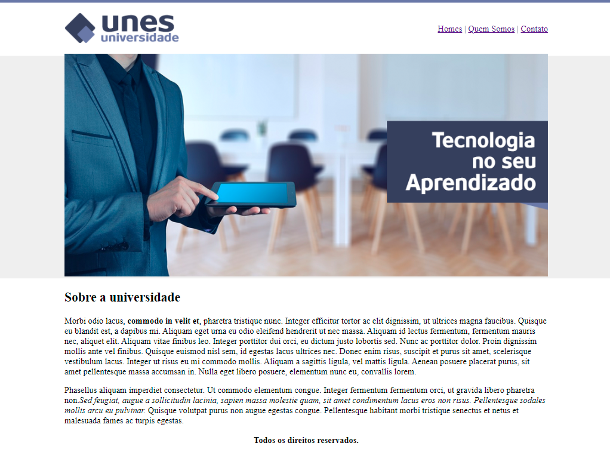
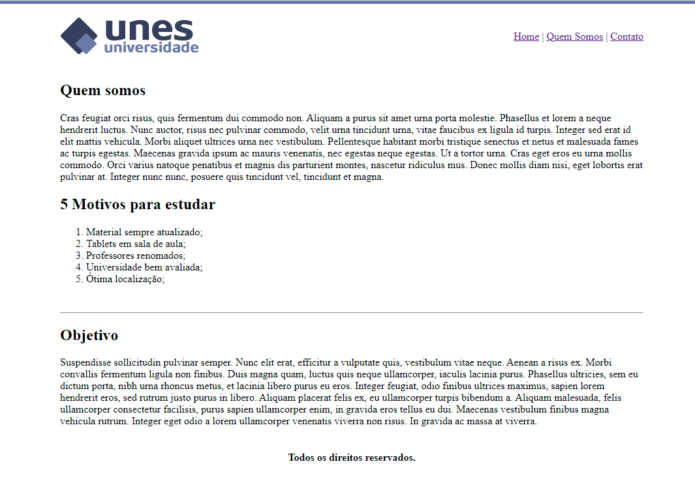
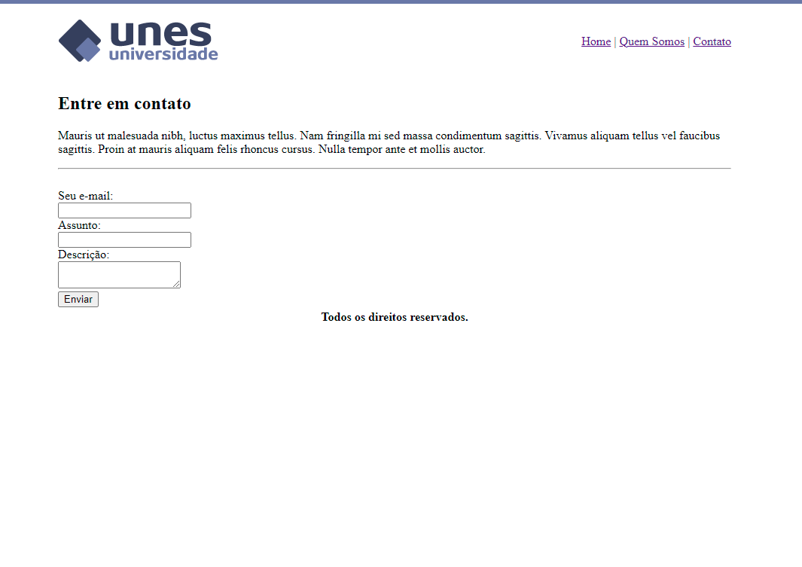

# Projeto1_UNES
>Projeto 1 da página institucional para a universidade
>fictícia UNES.

Primeiro projeto do curso de desenvolvimento web do [Udemy](https://www.udemy.com/course/web-completo/), com finalidade de por em prática os conhecimentos adquiridos na seção 3. 
Utilizando apenas com HTML básico.
 

## Objetivo

O projeto é voltado para quem está iniciando seus estudos em HTML, pois com algumas tags básicas foi possível criar um site com menu, logo, capa, uma lista de vantagens e um formulário para contato. O site foi estruturado tendo como base a tag `table`, porém não é a recomendado este método para projetos mais profissionais.

## :mailbox: Dados

**Links para contato:**

   
      

