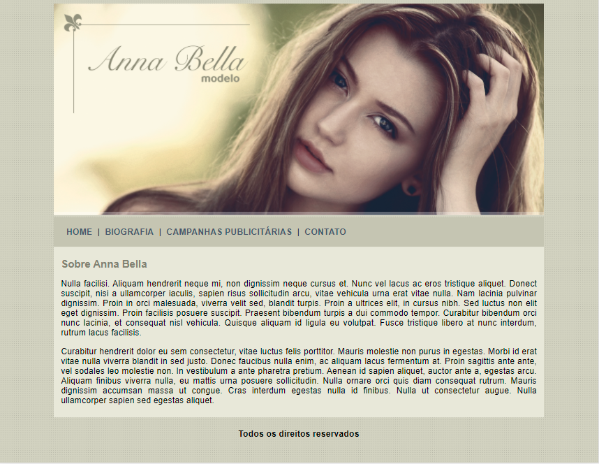
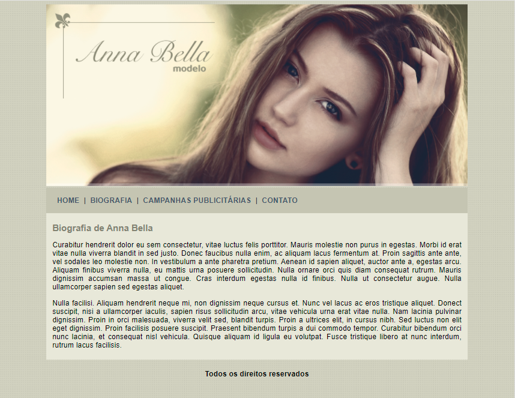
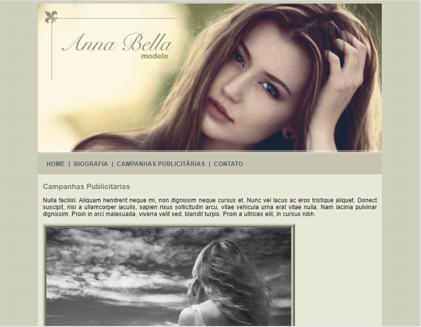
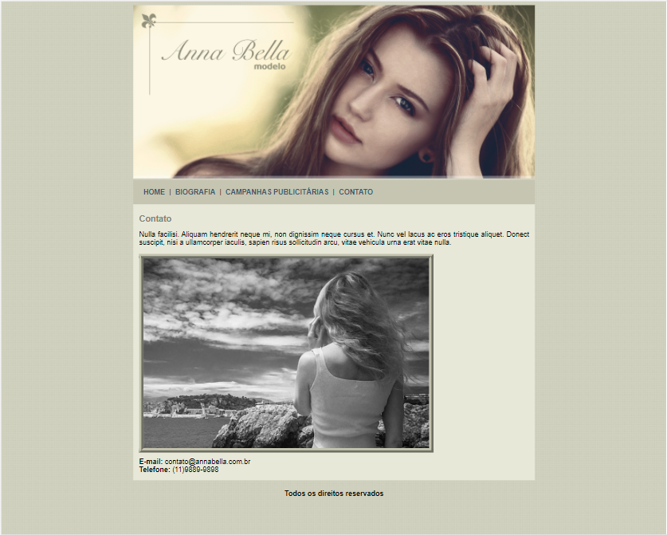

# Projeto2_AnaBella
>Site da modelo fictícia Anna Bella.

Projeto contendo página principal, biografia, campanhas publicitárias e contato da modelo, feito em html e css.Este é o 2º projeto do curso de Desenvolvimento Web que faço pela plataforma [Udemy](https://www.udemy.com/course/web-completo/), e introduz a estilização de páginas HTML com CSS.

## Objetivo

A finalidade deste projeto é iniciar, ao mesmo tempo por em prática, a estilização de páginas web com CSS e dar continuidade aos estudos de HTML. 

## :mailbox: Dados
**Links para contato:**

   
      

