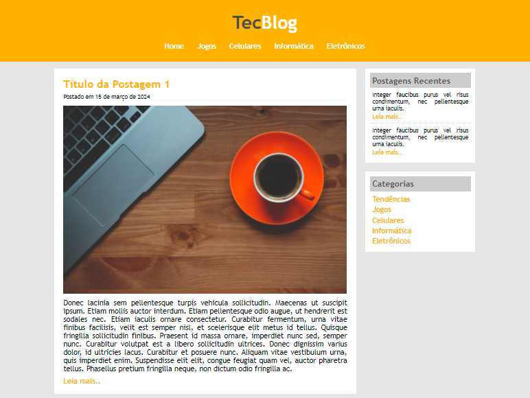
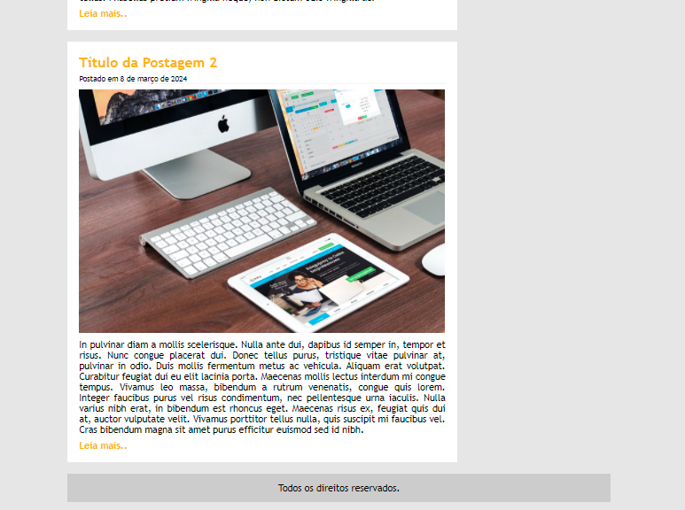
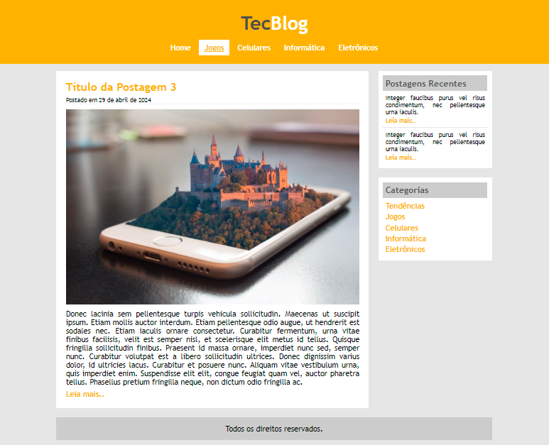

# Projeto3_TecBlog
>Blog fictício sobre tecnologia com menu, área de conteúdo e área lateral.

Este projeto finaliza módulo 2, que introduz os conhecimentos básicos sobre CSS, e com isso foi possível montar uma estrutura contendo um cabeçalho, com menu e logo do site, uma área de postagem e uma área lateral, que foi divida onde uma parte contém as últimas postagens e outra as categorias das matérias do site.

## Objetivo

Exercitar os conhecimentos adquiridos até o momento no curso, utilizar `id` e `class` para aplicar formatações. Com o uso do `float` alterar o fluxo dos elementos e assim criar um layout mais interessante.

## :mailbox: Dados
**Links para contato:**

   
      

