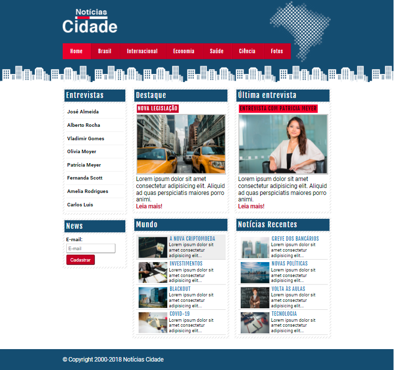
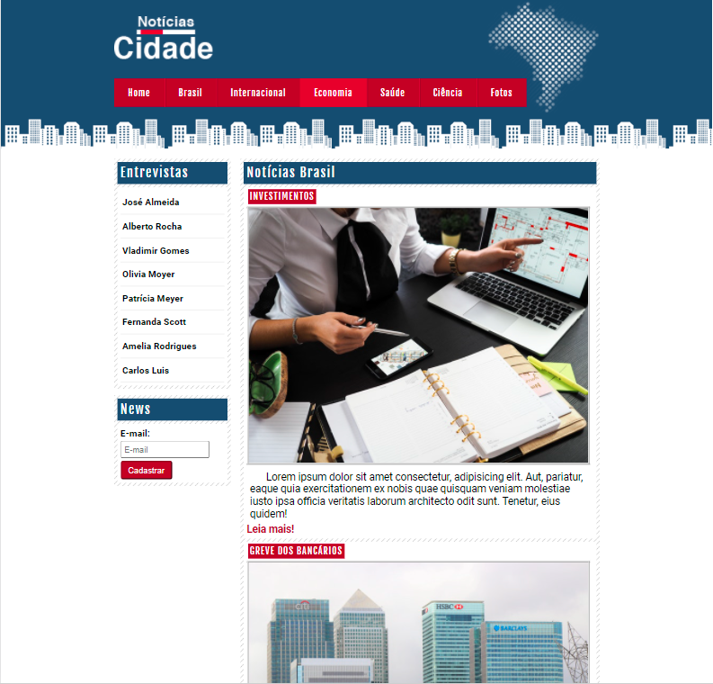
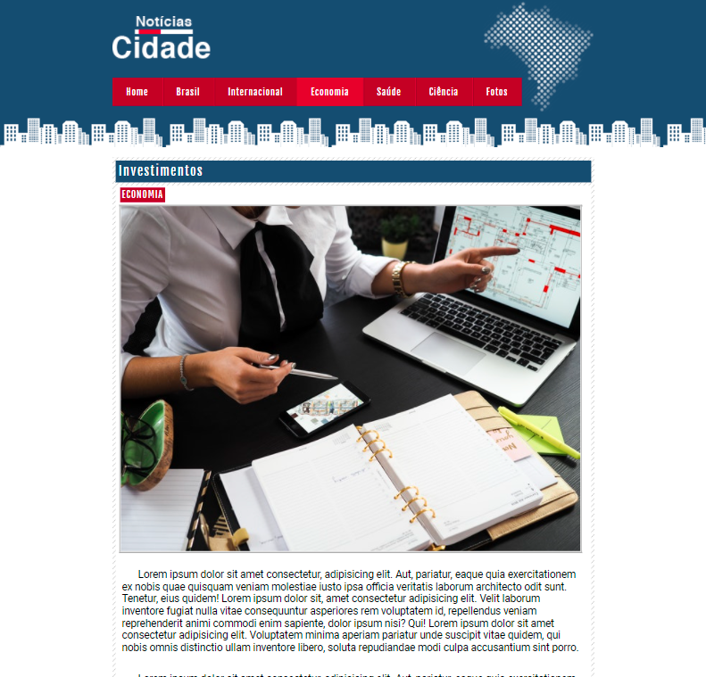

# Projeto4_PaginadeNoticias
>Projeto de um site fictício de notícias, para aplicar conceito de barra de navegação e layout em colunas.

## Objetivos

A ideia deste projeto é praticar o conhecimento adquirido neste módulo, sobre barras de navegação (horizontais e verticais), estruturas de layout (contendo 3, 2 ou 1 coluna), e de como aplicar formatações de estilo à formulários.

## :mailbox: Dados
**Links para contato:**

   
      

