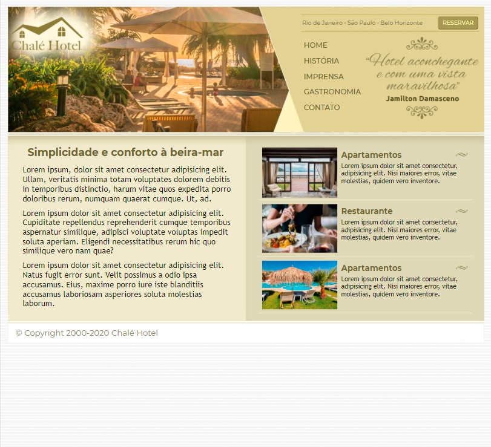
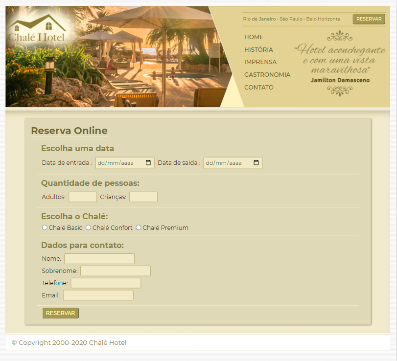

# projeto5_ChaleHotel
>Estudo de caso do site de um Chale fictício, onde será aplicado os conhecimentos adquiridos sobre layouts líquidos, entre outros. 

 

 
 Esta captura de tela mostra como ficou o projeto finalizado, mas como desafio pessoal resolvi criar a página com o formulário de reserva do Chalé. A captura à seguir mostra o resultado deste desafio.

 

 ## :clipboard: Objetivo
 O projeto Chalé Hotel teve como foco aprofundar os estudos sobre layouts líquidos e imagens líquidas, que foram temas abordados nesta seção, através da criação da página principal de um Chalé fictício. 
 A página com o formulário de reserva não faz parte do conteúdo aprensentado nas aulas do projeto, mas aproveitei para praticar os conhecimentos adquiridos sobre formulários.

## :mailbox: Dados

**Meus contatos:**

   
      

:file_folder: [Todos os projetos](https://github.com/danigvg/projetos_curso_web) 

