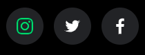

# projeto8_SpotifyClone
>Projeto visa reproduzir a interface do site do Spotify Brasil em 2018. 

## :camera: O Projeto

O gif a seguir mostra o resultado alcançado do projeto, em 4 tamanhos de telas diferentes.

## :clipboard: Objetivo

O objetivo era, com os conhecimentos adquiridos até o momento, conseguir reproduzir uma interface profissional como a do site do Spotify Brasil.
Como diferencial, a versão do Bootstrap utilizada para esse projeto foi a v5.0.2, e alguns componentes foram desenvolvidos de forma diferente para dar um toque pessoal ao projeto.
 - O grupo de imagens da seção *Recursos* foram alteradas para que a forma como são exibidas em dispositivos menores que 992px de largura, passasse de uma galeria com as 4 imagens distribuídas proporcionalmente para um carousel com indicadores, assim cada imagem pôde ser melhor aproveitada;

 - As imagens da seção *Facilidades* também foram alteradas, para que em dispositivos até 767px, tivessem um melhor aproveitamento da tela.
  
   Resultado sem alterações | Resultado com alterações
   -------------------------|--------------------------
    | 

 - O ícones das redes sociais, localizado no footer da página, foi feito inspirado na versão atual da página do [Spotify](https://www.spotify.com/br/), ao invés de utilizar as imagens disponibilizadas como recurso.

   Versão com imagens | Versão Spotify | Resultado
   -------------------|----------------|---------
    |  | 

## :mailbox: Dados

**Meus contatos:**

   
      

:file_folder: [Todos os projetos](https://github.com/danigvg/projetos_curso_web) 

