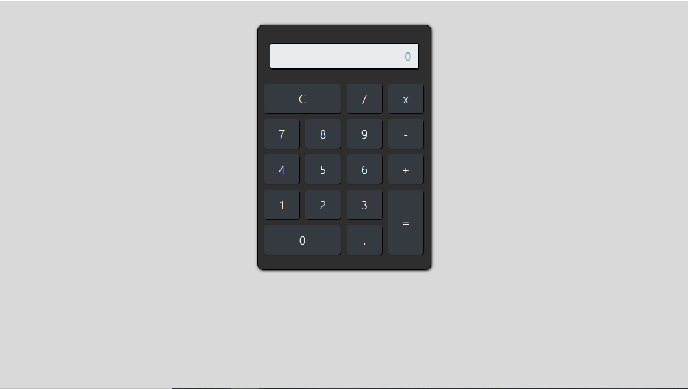
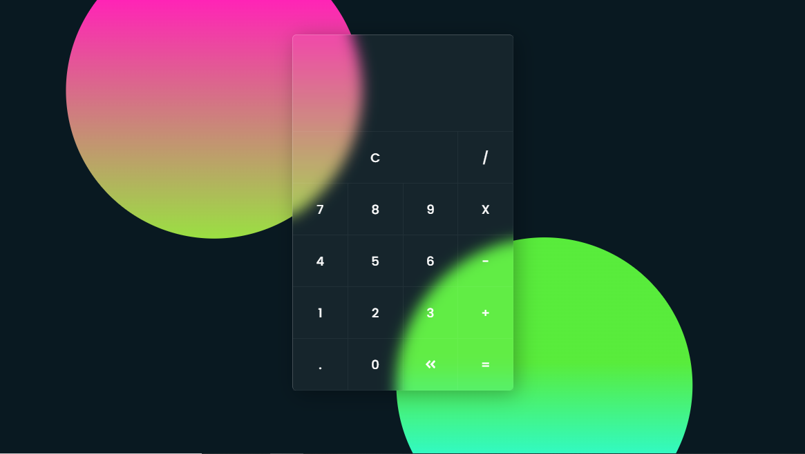
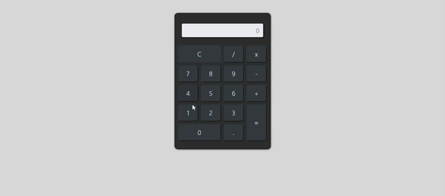
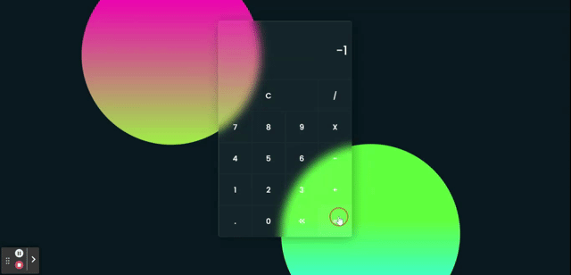
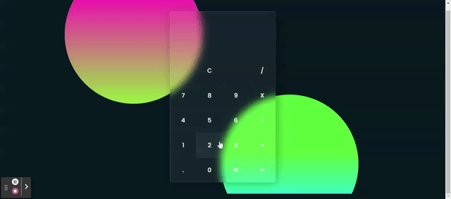

# projeto_APPCalculadora
>Primeiro projeto da seção de JavaScript.

## :camera: O Projeto

O gif a seguir mostra o projeto finalizado e em funcionamento.

## :clipboard: Objetivo

A ideia do projeto é pegar o conhecimento sobre javascript adquirido até esse ponto da seção, e criar uma calculadora que realize as funções mais básicas. Optei por não utilizar o layout fornecido no ínicio do exercício, e assim praticar a utilização do bootstrap e das técnicas de glassmorphism, e o resultado foi esse:

Calculadora disponibilizada no curso | Calculadora criada neste projeto
:-------------------------------------:|:---------------------------------:
|

Outro ponto alterado foi a captura do evento dos botões: **+**, **-**, **X**, **/** e **.**. O código desses botões dava abertura pra um erro que permitia colocar mais de um símbolo em sequência, impedindo a realização da conta. Para impedir isso criado uma condição que verifica se o símbolo anterior antes de escrever na tela. 

 - Sem a verificação isso acontece: 
 

~~~javascript
if(valor === '+' || valor === '-' || valor === '*' || valor === '/' || valor === '.'){
            document.getElementById('resultado').value += valor
          }
~~~

- Com a verificação é possível realizar as operações:

~~~~javascript
 //Insere Operador
        if (valor === '+' || valor === '-' || valor === '*' || valor === '/' || valor === '.') {
            let expressao = document.getElementById('display').value
            let ultimoCaractere = expressao.substr(-1);
            let operador = valor;
            let newexpressao;

            if (ultimoCaractere !== valor) {
                if (ultimoCaractere === '+' && operador === '-') {
                    newexpressao = expressao.replace(expressao.substr(-1), '-');
                    document.getElementById('display').value = newexpressao;
                } else if (ultimoCaractere === '+' && operador === '*') {
                    newexpressao = expressao.replace(expressao.substr(-1), '*');
                    document.getElementById('display').value = newexpressao;
                } else if(ultimoCaractere === '+' && operador === '/'){
                    newexpressao = expressao.replace(expressao.substr(-1), '/');
                    document.getElementById('display').value = newexpressao;
                 }else if (ultimoCaractere === '-' && operador === '+') {
                    newexpressao = expressao.replace(expressao.substr(-1), '+');
                    document.getElementById('display').value = newexpressao;
                } else if (ultimoCaractere === '-' && operador === '*') {
                    newexpressao = expressao.replace(expressao.substr(-1), '*');
                    document.getElementById('display').value = newexpressao;
                } else if (ultimoCaractere === '-' && operador === '/') {
                    newexpressao = expressao.replace(expressao.substr(-1), '/');
                    document.getElementById('display').value = newexpressao;
                } else if (ultimoCaractere === '*' && operador === '/') {
                    newexpressao = expressao.replace(expressao.substr(-1), '/');
                    document.getElementById('display').value = newexpressao;
                } else if (ultimoCaractere === '/' && operador === '*') {
                    newexpressao = expressao.replace(expressao.substr(-1), '*');
                    document.getElementById('display').value = newexpressao;
                } else {
                    document.getElementById('display').value += valor;
                }
            }
        }
~~~~
- E um detalhe diferencial que foi colocado no projeto foi o botão com a função de apagar: 

## :mailbox: Dados

**Meus contatos:**

   
      

:file_folder: [Todos os projetos](https://github.com/danigvg/projetos_curso_web) 